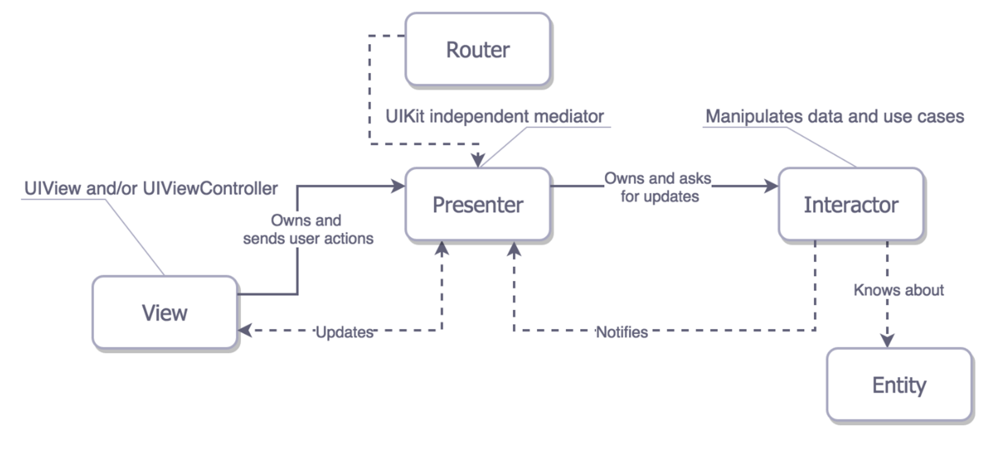

Beers from Punk API Example
========================

## Resume
This example iOS application shows items (Beers) obtained from Punk API (https://punkapi.com/).

## Features

- Show Beers:
    - Allows the user to browse the catalog of Beers whose name and image are displayed.
    - Filter this set of Beers by food pairing (Returns all beers matching the supplied food, this performs a fuzzy match).
    - Infinite Scrolling implemented (Fetch a limited number of Beers for each page, when last Beer is presented, then App ask for more Beers -> Next Page)
- Show details of a specific Beer:
    - Allows the user to view the details of a specific Beer such as: name, description, picture, tags, first brewed date, and food pairing items.
- Obscure mode enabled.
- Enabled languages: English and Spanish.
- Logs management with SwiftLog (https://github.com/daltoniam/SwiftLog)
 

## VIPER Architecture

This application has been developed using VIPER architecture, applying SOLID principles https://en.wikipedia.org/wiki/SOLID_(object-oriented_design)

**What is VIPER?**
VIPER is a backronym for View, Interactor, Presenter, Entity and Router. It’s basically an approach that implements the Single Responsibility Principle to create a cleaner and more modular structure for your iOS project. The idea behind this pattern is to isolate your app’s dependencies, balancing the delegation of responsibilities among the entities. This is achieved by using the the following architecture:

This diagram illustrates the VIPER architecture, in which each block corresponds to an object with specific tasks, inputs and outputs.

The connections between the blocks represent the relationship between the objects, and what kind of information they transmit to each other. The communication from one entity to another is given through protocols.

More about this in: https://cheesecakelabs.com/blog/ios-project-architecture-using-viper/

**Why VIPER?**:

- VIPER follows a very clean architecture https://8thlight.com/blog/uncle-bob/2012/08/13/the-clean-architecture.html
- It isolates each module from others. So changing or fixing bugs are very easy as you only have to update a specific module.
- Also for having modular approach VIPER creates a very good environment for unit testing.
- As each module is independent from others, it maintains low coupling very well. So, dividing work among co-developers are also pretty simple.
- We must make the independent architecture of any library that we use in development.
- The business logic should be able to be tested without the need for the user interface (UI), database, web server or other external tools.
- As the user interface is usually the element that is most exposed to change, we must make sure that they do not affect the rest of the development.
- Similar to the previous point, since the architecture is independent of the data layer, we can make changes in this part without affecting the business logic, having the possibility of changing an api by a webservice, a database by an api, or whatever combination we can think of.
- As a summary of the rest of the points, the business logic must be alien to everything that comes from the outside world, being able to change the rest of the pieces without affecting it.
- And a lot of more benefits.

**VIPER Modules Template**:

Using a VIPER template for Xcode -customized by myself- to create VIPER modules easily (using Storyboards)
- VIPER Template https://github.com/alopezhenquen/VIPER-by-Kill3r.xctemplate 

**VIPER in iOS Articles**:

- https://www.raywenderlich.com/8440907-getting-started-with-the-viper-architecture-pattern
- https://cheesecakelabs.com/blog/ios-project-architecture-using-viper/
- https://medium.com/kuka-mobile-tech/viper-architecture-on-ios-apps-d0dd863e16dd
- https://blog.cheesecakelabs.com/blog/best-practices-viper-architecture/
- https://theswiftdev.com/viper-best-practices-for-ios-developers/
- https://www.objc.io/issues/13-architecture/viper/
- https://medium.com/@smalam119/viper-design-pattern-for-ios-application-development-7a9703902af6

## Requirements

- iPhone/iPod Touch, iOS 13.0+.

## Dependencies

- Alamofire (Networking Layer)
- Kingfisher (Networking Layer -> Images)
- SwiftLog (Simple and easy logging in Swift)